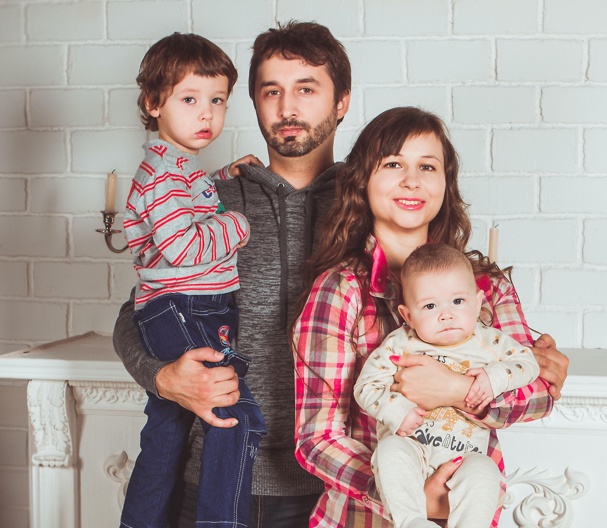
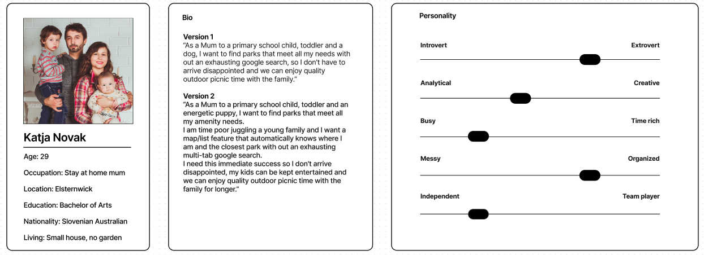
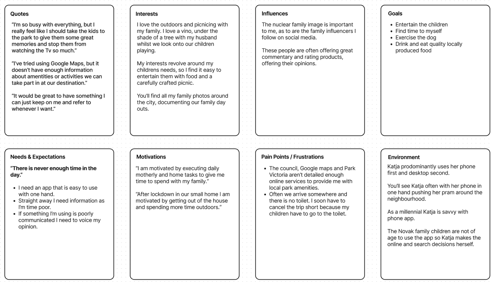
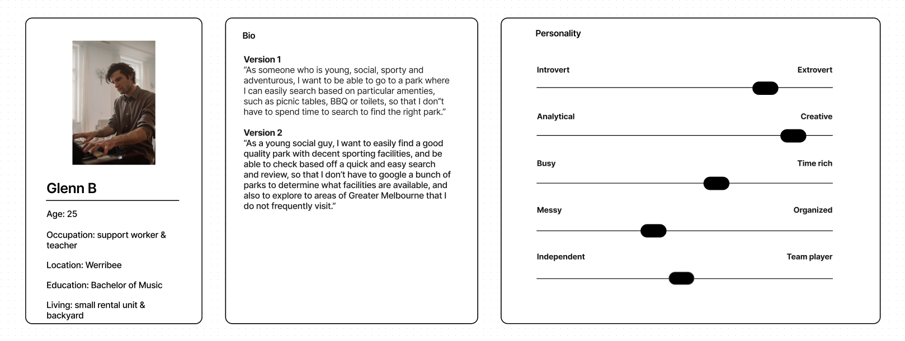

# **Picnic Vic**

###### **ASSESSMENT:** Full Stack Application - Part A

###### **DEV TEAM:** Karla Tolentino, Ruilai Zhang, Matthew Liu, Bella Leber-Smeaton

 

## **Picnic Vic Description**

> _Nothing is better than a picnic in Vic!_

#### **Client:**

Parks Victoria - Victorian State Government

#### **Purpose:**

In a post Covid world we now know more than ever that we need to connect with our friends and family, outdoors in the _real world_. We need to utilise our green open spaces to enrich our lives. 
To meet calls and pressure that local councils and the State Government aren't providing enough green space, Parks Victoria are creating a new inner city park database. For small and large parks alike! 
The **Picnic Vic** app provides detailed park amenity information to help facilitate a family picnic to a skate park hangout.  
**_A park is nothing without a picnic and nothing is better than a picnic in Vic!_**   
Want to reach peak Vic picnic? 🍷 + 🧀 = 🧺  
The Picnic Vic app have teamed up with Victorian Wine and Cheese producers to pair your local park with local picnic produce.  
_It doesn't get much Gouda than that._
  

#### **Functionality / Features:**

#### **Target Audience:**

**Who:** The Novaks. 'The Nuclear Family, with dog'. Two parents. Two Children. One puppy.  
**Age:** Parents are late twenties to late thirties, 28-38. One child is of primary school age 7, and one two year old.  
**Occupation:** One stay at home parent, the other working 9-5. Children are young learners. 
**Nationality:** Slovenian Australians. 
**Income:** Lower middle Class, one income of 80k/annum.  
**Religion:** Non practicing/ 'lapsed Catholic'. 
**Location:** Local resident. Elsternwick, 3185. South-Eastern Suburbs.  
**Living circumstances:** Smaller townhouse with no garden. 
**What is the problem this Target Audience needs solving?** 
The Novaks have a young family and no backyard, so they spend a lot of their family time outside of the home to entertain their young children. They go for walks with their dog so they also need parks that allow for dogs and an off leash area. Picnics are a regular occurrence for the Novaks.  
As a family they have a lot of needs that have to be met for an enjoyable picnic. Their number 1 problem is that most parks near them don't have toilet / change table facilities and a playground. They wish they had the ability to look this up so they don't have to arrive disappointed.
Their ultimate park is one that has a toilet, cover from the sun, a playground and dog park. An 'all-in-one' park scenario. Their lower grade park might be one they take their dog to for a short morning walk.  

---

**Who:**  Glenn B. Single male 
**Age:** 25 years old 
**Occupation:** Music teacher and support worker for special needs children. Living with another housemate 
**Nationality:** Australian 
**Income:** Lower middle class. Income approx. $50-60k per annum 
**Religion:** Agnostic 
**Location:** Werribee, 3030. Western Suburbs 
**Living circumstances:** Currently renting in a small unit and small backyard 
**What is the problem this Target Audience needs solving?** 
Glenn is a person in his mid 20s. With a small backyard at his rental, he will usually go out and explore the nearby park or reserve to get some fresh air. He is quite keen to visit and explore new places
 
The problem that Glenn are two fold:  1. Finding the right park with right facilities. Many times, he has tried to find information on the a particular park, only to find that park does not have the correct facilities.
2.  Finding a different variety of parks. As someone who loves exploring, Glenn feels like that some parks feel that some parks around his area feel quite underwhelming, and would like to find a way to distinguish and filter out parks, based on what they have to offer

---

**Who:**  
**Age:**  
**Occupation:**  
**Nationality:**  
**Income:**  
**Religion:**  
**Location:**  
**Living circumstances:**  
**What is the problem this Target Audience needs solving?** 
 

---

**Who:**  
**Age:**  
**Occupation:**  
**Nationality:**  
**Income:**  
**Religion:**  
**Location:**  
**Living circumstances:**  
**What is the problem this Target Audience needs solving?** 
 

---

#### **Tech Stack:**

| Application and Data | Utilities  | DevOps  | Business Tools |
| -------------------- | ---------- | ------- | -------------- |
| HTML 5               | Postman    | GitHub  | Trello         |
| CSS                  | JWT/Devise | Git     | G Suite        |
| JavaScript ES6       | NPM        | VS Code | Discord        |
| Rails                | Ruby Gems  |         | Figma          |
| React                | Google API |         | Google Fonts   |
| PostgreSQL           | RSPEC      |         | Zoom           |
| Amazon S3            | Jest       |         |                |
| Heroku               |            |         |                |
| Netlify              |            |         |                |
|                      |            |         |                |

 

## **Dataflow Diagram:**

<!-- Show at least 2 dataflow diagrams that follow a set dataflow convention -->

## **Application Architecture Diagram:**

## **Park Vic User Stories:**

<!-- Show 2 versions of user stories 'shows evidence of user story revision and refinement' -->

### [Katja Novak](<https://www.figma.com/file/InWmz7kkpj2u7o86HhEdsl/User-personas-(Community)?node-id=0%3A1>)

### [Glenn B](https://www.figma.com/file/2DryqFWrEVPYJMFjB7luzn/A-user-persona?node-id=0%3A1)

### 

### 

## **Device Wireframes:**

<!-- Show 2 versions of your FIGMA wireframes -->

## **Project Management:**

<!-- State chosen standards and planning methodology -->
